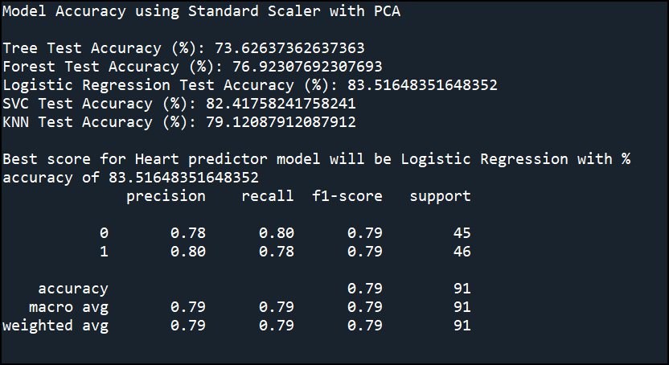
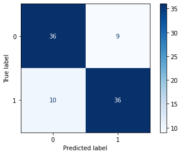

# Heart_Analysis_Prediction
 This model predict heart related data and analyse potential heart attack

# Description
This is a project to analyse patient's heart related data to determine whether there is positive or negative chance to develop a heart attack or not.

# How to use it
Clone the repo and run it.

Deploy_heart_pred_app.py is a script to train the data

Deploy_heart_pred_app.py is a script for deployment and viewing the app in web browser via Streamlit.

# Credit
Credit goes to rashikrahmanpritom for the dataset
https://www.kaggle.com/rashikrahmanpritom/heart-attack-analysis-prediction-dataset

# Images

The best model that was selected is Logistic Regression based on the Machine Learning Pipeline.

The accuracy of the model is 83.5% using the Logistic Regresssion with Principal Component Analysis (PCA) and Standard Scaling.

Below image is a Confusion Matrix which shows the predicted model that was feed with test data (91 dataset) and how many dataset that are predicted correctly with 1 or 0 output. 

(output of 0: 36 out of 46 predicted correctly)

(output of 1: 36 out of 45 predicted correctly)

